# Alan Hirsch Database Schema Documentation

**Generated:** 2025-01-27
**Source:** Direct Supabase MCP introspection
**Project:** alan-hirsch (nepvfebkqvuqbxthttao)
**Database:** PostgreSQL 17.6.1.005
**Region:** us-east-1

## Table of Contents

1. [Project Overview](#project-overview)
2. [Database Statistics](#database-statistics)
3. [Core Tables](#core-tables)
4. [Row Level Security (RLS)](#row-level-security-rls)
5. [Extensions](#extensions)
6. [Migrations](#migrations)
7. [Storage](#storage)
8. [Entity Relationship Diagram](#entity-relationship-diagram)

## Project Overview

The Alan Hirsch platform is a comprehensive ministry leadership platform built on Supabase with PostgreSQL. It features:

- **Multi-tenant architecture** with organization-based access control
- **APEST integration** (Apostolic, Prophetic, Evangelistic, Shepherding, Teaching)
- **Assessment system** with cultural context support
- **Content management** with AI enhancement
- **Subscription billing** via Stripe integration
- **Community features** with global cultural support

## Database Statistics

- **Total Tables:** 12 (public schema)
- **Total RLS Policies:** 25
- **Total Extensions:** 4 (installed)
- **Total Migrations:** 5
- **Storage Buckets:** 1 (blog-images)

## Core Tables

### User Management

#### `user_profiles`

Extended user profiles with ministry context and APEST integration.

**Key Features:**

- Ministry role and denomination tracking
- APEST assessment scores (6 dimensions)
- Cultural context and language support
- Brand customization and privacy settings
- Onboarding workflow tracking

**Notable Columns:**

- `assessment_movement_alignment` through `assessment_strategic_fit` - APEST scoring
- `theological_focus` (jsonb) - Array of theological areas
- `brand_colors` (jsonb) - Custom color scheme
- `privacy_settings` (jsonb) - Granular privacy controls
- `subdomain`/`custom_domain` - Multi-tenant subdomain support

**RLS Policies:**

- Users can manage their own profiles
- Public profiles visible based on privacy settings
- Account status controls visibility

#### `organizations`

Multi-tenant organization structure.

**Key Features:**

- Organization types and size categories
- Billing and contact information
- License type management (individual/team)
- Account owner relationship

**RLS Policies:**

- Organization members can view org data
- Account owners can update organizations
- Users can create organizations

#### `organization_memberships`

User-organization relationships with role-based access.

**Key Features:**

- Role-based permissions (jsonb)
- Invitation workflow
- Status tracking (pending/active)

**RLS Policies:**

- Users can manage their own memberships
- Invitation system support

### Content System

#### `content_categories`

Hierarchical content categorization with APEST integration.

**Key Features:**

- Self-referencing parent-child relationships
- APEST relevance scoring (jsonb)
- Movement relevance scoring
- Theological discipline categorization

**RLS Policies:**

- Public read access for active categories

#### `content_items`

Main content repository with AI enhancement and network amplification.

**Key Features:**

- Rich content metadata (word count, reading time)
- AI enhancement tracking
- Network amplification scoring
- Multi-format support (text, video, audio)
- Series and co-author support
- License and attribution management

**RLS Policies:**

- Authors can manage their own content
- Published content publicly readable
- Draft content private to authors

#### `communities`

Discussion groups and networking spaces with cultural context.

**Key Features:**

- Geographic and cultural focus
- Multi-language support
- Moderation and approval workflows
- Member and post counting

**RLS Policies:**

- Public communities viewable by all
- Private communities restricted

### Assessment System

#### `assessments`

Assessment definitions and metadata with cultural adaptation.

**Key Features:**

- Multiple assessment types (APEST, MDNA, etc.)
- Cultural adaptation support (7 regions)
- Research-backed validation
- Multiple scoring methods
- Version control

**RLS Policies:**

- Authenticated users can view assessments

#### `assessment_questions`

Individual questions within assessments.

**Key Features:**

- APEST dimension mapping
- Multiple question types
- Weight and reverse scoring
- Order indexing

**RLS Policies:**

- Authenticated users can view questions

#### `user_assessments`

User assessment attempts and results with AI insights.

**Key Features:**

- APEST score breakdown
- Cultural adjustment factors
- AI-generated insights and recommendations
- Peer suggestion system
- Completion tracking

**RLS Policies:**

- Users can only access their own assessments

#### `assessment_responses`

Individual question responses with timing and confidence.

**Key Features:**

- Response timing tracking
- Confidence levels
- Skip tracking
- Response consistency analysis

**RLS Policies:**

- Users can only access their own responses

### Subscription & Billing

#### `subscription_plans`

Tiered access plans with feature matrices.

**Key Features:**

- Stripe integration (product/price IDs)
- Feature matrices (jsonb)
- Usage limits and quotas
- Trial period support

**RLS Policies:**

- Public read access for active plans

#### `user_subscriptions`

User subscription records and billing with usage tracking.

**Key Features:**

- Stripe subscription management
- AI interaction limits and usage
- Revenue tracking
- Trial and cancellation management

**RLS Policies:**

- Users can view their own subscriptions

## Row Level Security (RLS)

All tables implement Row Level Security with comprehensive policies:

### Policy Summary

| Table                      | RLS Enabled | Read Access                  | Write Access                        | Admin Access |
| -------------------------- | ----------- | ---------------------------- | ----------------------------------- | ------------ |
| `user_profiles`            | ✅          | Public profiles, Own profile | Own profile                         | Own profile  |
| `organizations`            | ✅          | Members can view             | Owners can update, Users can create | -            |
| `organization_memberships` | ✅          | Own memberships              | Own memberships                     | -            |
| `content_categories`       | ✅          | Public (active only)         | -                                   | -            |
| `content_items`            | ✅          | Published public content     | Authors can manage                  | -            |
| `subscription_plans`       | ✅          | Public (active only)         | -                                   | -            |
| `user_subscriptions`       | ✅          | Own subscriptions            | -                                   | -            |
| `communities`              | ✅          | Public communities           | -                                   | -            |
| `assessments`              | ✅          | Authenticated users          | -                                   | -            |
| `assessment_questions`     | ✅          | Authenticated users          | -                                   | -            |
| `user_assessments`         | ✅          | Own assessments              | Own assessments                     | -            |
| `assessment_responses`     | ✅          | Own responses                | Own responses                       | -            |

### Key Security Principles

1. **User Data Isolation:** Users can only access their own data
2. **Public Content Filtering:** Only published/active content is publicly accessible
3. **Organization Access:** Members can access organization data
4. **Assessment Privacy:** Assessment results are private to users
5. **Content Authorship:** Authors have full control over their content

## Extensions

**Installed Extensions:**

- `pgcrypto` (1.3) - Cryptographic functions
- `uuid-ossp` (1.1) - UUID generation
- `pg_graphql` (1.5.11) - GraphQL API support
- `pg_stat_statements` (1.11) - Query performance monitoring
- `supabase_vault` (0.3.1) - Secure storage

## Migrations

**Applied Migrations:**

1. `20251002` - comprehensive_alan_hirsch_schema
2. `20251002070340` - enable_rls_user_profiles_only
3. `20251002070403` - enable_rls_existing_tables
4. `20251002090616` - create_assessment_system
5. `20251003121947` - fix_missing_rls_policies

## Storage

**Storage Buckets:**

- `blog-images` - Public bucket for content media
  - File size limit: 10MB
  - Allowed types: image/jpeg, image/jpg, image/png, image/gif, image/webp, image/svg+xml

## Entity Relationship Diagram

```mermaid
erDiagram
    user_profiles {
        uuid id PK
        text email UK
        text first_name
        text last_name
        text ministry_role
        text denomination
        text organization_name
        integer years_in_ministry
        text country_code
        text timezone
        text cultural_context
        integer assessment_movement_alignment
        integer assessment_audience_engagement
        integer assessment_content_readiness
        integer assessment_revenue_potential
        integer assessment_network_effects
        integer assessment_strategic_fit
        integer assessment_total
        text leader_tier
        text subdomain UK
        text custom_domain UK
        text platform_title
        text language_primary
        text subscription_tier
        jsonb theological_focus
        jsonb brand_colors
        jsonb email_notifications
        jsonb privacy_settings
        boolean onboarding_completed
        integer onboarding_step
        text account_status
        timestamp created_at
        timestamp updated_at
        timestamp last_active_at
    }

    organizations {
        uuid id PK
        text name
        text slug UK
        text description
        text website
        text logo_url
        text organization_type
        text size_category
        text contact_email
        text contact_phone
        jsonb address
        text billing_email
        uuid account_owner_id FK
        text license_type
        integer max_users
        text status
        timestamp created_at
        timestamp updated_at
    }

    organization_memberships {
        uuid id PK
        uuid user_id FK
        uuid organization_id FK
        text role
        timestamp invited_at
        uuid invited_by FK
        jsonb permissions
        text status
        timestamp joined_at
        timestamp created_at
        timestamp updated_at
    }

    content_categories {
        uuid id PK
        text name
        text slug UK
        text description
        uuid parent_id FK
        text theological_discipline
        text meta_description
        integer order_index
        integer movement_relevance_score
        jsonb apest_relevance
        jsonb keywords
        boolean is_active
        timestamp created_at
        timestamp updated_at
    }

    content_items {
        uuid id PK
        text title
        text slug UK
        text excerpt
        text content
        uuid author_id FK
        text content_type
        integer word_count
        integer estimated_reading_time
        uuid primary_category_id FK
        uuid series_id
        integer series_order
        text ai_summary
        text featured_image_url
        text video_url
        text audio_url
        text meta_title
        text meta_description
        text canonical_url
        text original_source
        timestamp published_at
        timestamp scheduled_at
        jsonb co_authors
        text format
        integer view_count
        integer like_count
        integer share_count
        integer comment_count
        integer bookmark_count
        jsonb secondary_categories
        jsonb tags
        jsonb theological_themes
        text visibility
        text status
        numeric network_amplification_score
        integer cross_reference_count
        boolean ai_enhanced
        jsonb ai_key_points
        jsonb attachments
        text license_type
        boolean attribution_required
        timestamp created_at
        timestamp updated_at
    }

    subscription_plans {
        uuid id PK
        text name
        text slug UK
        text description
        text plan_type
        numeric price_monthly
        numeric price_annual
        text content_access_level
        jsonb features
        integer storage_limit
        integer bandwidth_limit
        text stripe_product_id UK
        text stripe_price_id_monthly
        text stripe_price_id_annual
        text currency
        integer max_users
        boolean is_active
        boolean is_popular
        integer sort_order
        integer trial_days
        timestamp created_at
        timestamp updated_at
    }

    user_subscriptions {
        uuid id PK
        uuid user_id FK
        uuid plan_id FK
        uuid leader_profile_id FK
        uuid organization_id FK
        text status
        numeric amount
        text billing_cycle
        integer ai_interactions_limit
        timestamp trial_ends_at
        timestamp current_period_start
        timestamp current_period_end
        timestamp cancelled_at
        text stripe_subscription_id UK
        text stripe_customer_id
        text currency
        integer ai_interactions_used
        integer storage_used
        boolean cancel_at_period_end
        integer months_subscribed
        numeric total_revenue
        timestamp created_at
        timestamp updated_at
    }

    communities {
        uuid id PK
        text name
        text slug UK
        text description
        text community_type
        integer max_members
        text guidelines
        uuid created_by FK
        jsonb geographic_focus
        text cultural_context
        text language_primary
        jsonb languages_supported
        text visibility
        boolean join_approval_required
        boolean allow_guest_posts
        text moderation_level
        integer current_member_count
        integer total_posts_count
        jsonb rules
        jsonb moderators
        boolean is_active
        timestamp created_at
        timestamp updated_at
    }

    assessments {
        uuid id PK
        text name
        text slug UK
        text description
        text assessment_type
        integer questions_count
        integer estimated_duration
        integer passing_score
        numeric validity_score
        numeric reliability_score
        text instructions
        timestamp published_at
        text version
        text language
        text cultural_adaptation
        boolean research_backed
        text scoring_method
        text status
        timestamp created_at
        timestamp updated_at
    }

    assessment_questions {
        uuid id PK
        uuid assessment_id FK
        text question_text
        text question_type
        integer order_index
        text category
        text apest_dimension
        jsonb answer_options
        boolean is_required
        numeric weight
        boolean reverse_scored
        timestamp created_at
        timestamp updated_at
    }

    user_assessments {
        uuid id PK
        uuid user_id FK
        uuid assessment_id FK
        timestamp completed_at
        jsonb raw_scores
        integer total_score
        integer max_possible_score
        integer apostolic_score
        integer prophetic_score
        integer evangelistic_score
        integer shepherding_score
        integer teaching_score
        jsonb normalized_scores
        text primary_gift
        text secondary_gift
        numeric response_consistency
        integer completion_time
        integer confidence_level
        numeric cultural_adjustment_factor
        text ai_insights
        jsonb personalized_recommendations
        timestamp started_at
        integer completion_percentage
        boolean cultural_adjustment_applied
        jsonb suggested_peers
        jsonb complementary_gifts
        timestamp created_at
        timestamp updated_at
    }

    assessment_responses {
        uuid id PK
        uuid user_assessment_id FK
        uuid question_id FK
        integer response_value
        text response_text
        integer response_time
        integer confidence
        boolean skipped
        timestamp created_at
        timestamp updated_at
    }

    %% Relationships
    user_profiles ||--o{ organizations : "owns"
    user_profiles ||--o{ organization_memberships : "member"
    organizations ||--o{ organization_memberships : "has"
    user_profiles ||--o{ organization_memberships : "invited_by"
    content_categories ||--o{ content_categories : "parent"
    content_categories ||--o{ content_items : "categorizes"
    user_profiles ||--o{ content_items : "authors"
    user_profiles ||--o{ user_subscriptions : "subscribes"
    subscription_plans ||--o{ user_subscriptions : "plan"
    user_profiles ||--o{ user_subscriptions : "leader_profile"
    organizations ||--o{ user_subscriptions : "organization"
    user_profiles ||--o{ communities : "creates"
    assessments ||--o{ assessment_questions : "contains"
    assessments ||--o{ user_assessments : "taken_by"
    user_profiles ||--o{ user_assessments : "takes"
    user_assessments ||--o{ assessment_responses : "has"
    assessment_questions ||--o{ assessment_responses : "answered_by"
```

---

**This documentation is generated directly from the live Supabase database and represents the current state of the schema as of 2025-01-27.**
