# Alan Hirsch Platform - Comprehensive Database Documentation

## 📋 Executive Summary

This document provides a complete technical overview of the Alan Hirsch Platform database schema, designed for ministry leaders, developers, and system administrators. The platform is built on **PostgreSQL 17.6.1** with **Supabase** as the backend-as-a-service platform.

### Key Statistics

- **12 Core Tables** with comprehensive relationships
- **25 Row Level Security (RLS) Policies** ensuring data protection
- **32 Indexes** for optimal performance
- **17 Foreign Key Relationships** maintaining data integrity
- **5 Extensions** providing advanced functionality

---

## 🏗️ System Architecture

### Technology Stack

| Component  | Technology   | Version | Purpose                    |
| ---------- | ------------ | ------- | -------------------------- |
| Database   | PostgreSQL   | 17.6.1  | Primary data storage       |
| Backend    | Supabase     | Latest  | Backend-as-a-Service       |
| Frontend   | Next.js      | 14+     | React framework            |
| Styling    | Tailwind CSS | Latest  | Utility-first CSS          |
| ORM        | Drizzle      | Latest  | Type-safe database queries |
| Validation | Zod          | Latest  | Runtime type validation    |
| Payments   | Stripe       | Latest  | Subscription management    |

### Core Features

- **Multi-tenant Architecture** - Organization-based access control
- **APEST Integration** - Built-in support for Apostolic, Prophetic, Evangelistic, Shepherding, Teaching dimensions
- **AI Enhancement** - Content and assessment AI features
- **Cultural Context** - Support for global ministry contexts
- **Stripe Integration** - Subscription and billing management

---

## 📊 Database Schema Overview

### Entity Relationship Diagram

```mermaid
erDiagram
    user_profiles {
        uuid id PK
        text email UK
        text first_name
        text last_name
        text display_name
        text bio
        text avatar_url
        text ministry_role
        text denomination
        text organization_name
        integer years_in_ministry
        text country_code
        text timezone
        text cultural_context
        integer assessment_movement_alignment
        integer assessment_audience_engagement
        integer assessment_content_readiness
        integer assessment_revenue_potential
        integer assessment_network_effects
        integer assessment_strategic_fit
        integer assessment_total
        text leader_tier
        text subdomain UK
        text custom_domain UK
        text platform_title
        text language_primary
        text subscription_tier
        jsonb theological_focus
        jsonb brand_colors
        jsonb email_notifications
        jsonb privacy_settings
        boolean onboarding_completed
        integer onboarding_step
        text account_status
        timestamp created_at
        timestamp updated_at
        timestamp last_active_at
    }

    organizations {
        uuid id PK
        text name
        text slug UK
        text description
        text website
        text logo_url
        text organization_type
        text size_category
        text contact_email
        text contact_phone
        jsonb address
        text billing_email
        uuid account_owner_id FK
        text license_type
        integer max_users
        text status
        timestamp created_at
        timestamp updated_at
    }

    organization_memberships {
        uuid id PK
        uuid user_id FK
        uuid organization_id FK
        text role
        timestamp invited_at
        uuid invited_by FK
        jsonb permissions
        text status
        timestamp joined_at
        timestamp created_at
        timestamp updated_at
    }

    content_categories {
        uuid id PK
        text name
        text slug UK
        text description
        uuid parent_id FK
        text theological_discipline
        text meta_description
        integer order_index
        integer movement_relevance_score
        jsonb apest_relevance
        jsonb keywords
        boolean is_active
        timestamp created_at
        timestamp updated_at
    }

    content_items {
        uuid id PK
        text title
        text slug UK
        text excerpt
        text content
        uuid author_id FK
        text content_type
        integer word_count
        integer estimated_reading_time
        uuid primary_category_id FK
        uuid series_id
        integer series_order
        text ai_summary
        text featured_image_url
        text video_url
        text audio_url
        text meta_title
        text meta_description
        text canonical_url
        text original_source
        timestamp published_at
        timestamp scheduled_at
        jsonb co_authors
        text format
        integer view_count
        integer like_count
        integer share_count
        integer comment_count
        integer bookmark_count
        jsonb secondary_categories
        jsonb tags
        jsonb theological_themes
        text visibility
        text status
        numeric network_amplification_score
        integer cross_reference_count
        boolean ai_enhanced
        jsonb ai_key_points
        jsonb attachments
        text license_type
        boolean attribution_required
        timestamp created_at
        timestamp updated_at
    }

    subscription_plans {
        uuid id PK
        text name
        text slug UK
        text description
        text plan_type
        numeric price_monthly
        numeric price_annual
        text content_access_level
        jsonb features
        integer storage_limit
        integer bandwidth_limit
        text stripe_product_id UK
        text stripe_price_id_monthly
        text stripe_price_id_annual
        text currency
        integer max_users
        boolean is_active
        boolean is_popular
        integer sort_order
        integer trial_days
        timestamp created_at
        timestamp updated_at
    }

    user_subscriptions {
        uuid id PK
        uuid user_id FK
        uuid plan_id FK
        uuid leader_profile_id FK
        uuid organization_id FK
        text status
        numeric amount
        text billing_cycle
        integer ai_interactions_limit
        timestamp trial_ends_at
        timestamp current_period_start
        timestamp current_period_end
        timestamp cancelled_at
        text stripe_subscription_id UK
        text stripe_customer_id
        text currency
        integer ai_interactions_used
        integer storage_used
        boolean cancel_at_period_end
        integer months_subscribed
        numeric total_revenue
        timestamp created_at
        timestamp updated_at
    }

    communities {
        uuid id PK
        text name
        text slug UK
        text description
        text community_type
        integer max_members
        text guidelines
        uuid created_by FK
        jsonb geographic_focus
        text cultural_context
        text language_primary
        jsonb languages_supported
        text visibility
        boolean join_approval_required
        boolean allow_guest_posts
        text moderation_level
        integer current_member_count
        integer total_posts_count
        jsonb rules
        jsonb moderators
        boolean is_active
        timestamp created_at
        timestamp updated_at
    }

    assessments {
        uuid id PK
        text name
        text slug UK
        text description
        text assessment_type
        integer questions_count
        integer estimated_duration
        integer passing_score
        numeric validity_score
        numeric reliability_score
        text instructions
        timestamp published_at
        text version
        text language
        text cultural_adaptation
        boolean research_backed
        text scoring_method
        text status
        timestamp created_at
        timestamp updated_at
    }

    assessment_questions {
        uuid id PK
        uuid assessment_id FK
        text question_text
        text question_type
        integer order_index
        text category
        text apest_dimension
        jsonb answer_options
        boolean is_required
        numeric weight
        boolean reverse_scored
        timestamp created_at
        timestamp updated_at
    }

    user_assessments {
        uuid id PK
        uuid user_id FK
        uuid assessment_id FK
        timestamp completed_at
        jsonb raw_scores
        integer total_score
        integer max_possible_score
        integer apostolic_score
        integer prophetic_score
        integer evangelistic_score
        integer shepherding_score
        integer teaching_score
        jsonb normalized_scores
        text primary_gift
        text secondary_gift
        numeric response_consistency
        integer completion_time
        integer confidence_level
        numeric cultural_adjustment_factor
        text ai_insights
        jsonb personalized_recommendations
        timestamp started_at
        integer completion_percentage
        boolean cultural_adjustment_applied
        jsonb suggested_peers
        jsonb complementary_gifts
        timestamp created_at
        timestamp updated_at
    }

    assessment_responses {
        uuid id PK
        uuid user_assessment_id FK
        uuid question_id FK
        integer response_value
        text response_text
        integer response_time
        integer confidence
        boolean skipped
        timestamp created_at
        timestamp updated_at
    }

    %% Relationships
    user_profiles ||--o{ organizations : "owns"
    user_profiles ||--o{ organization_memberships : "member"
    organizations ||--o{ organization_memberships : "has"
    user_profiles ||--o{ organization_memberships : "invited_by"
    content_categories ||--o{ content_categories : "parent"
    content_categories ||--o{ content_items : "categorizes"
    user_profiles ||--o{ content_items : "authors"
    user_profiles ||--o{ user_subscriptions : "subscribes"
    subscription_plans ||--o{ user_subscriptions : "plan"
    user_profiles ||--o{ user_subscriptions : "leader_profile"
    organizations ||--o{ user_subscriptions : "organization"
    user_profiles ||--o{ communities : "creates"
    assessments ||--o{ assessment_questions : "contains"
    assessments ||--o{ user_assessments : "taken_by"
    user_profiles ||--o{ user_assessments : "takes"
    user_assessments ||--o{ assessment_responses : "has"
    assessment_questions ||--o{ assessment_responses : "answered_by"
```

---

## 🔐 Security Model

### Row Level Security (RLS) Implementation

All tables implement Row Level Security (RLS) with policies that ensure:

#### User Profiles

- **Public Access**: Users with `publicProfile: true` and `account_status: 'active'`
- **Self Access**: Users can always access their own profile
- **No Delete**: No delete policy (soft delete via `account_status`)

#### Organizations

- **Member Access**: Organization members can view organization data
- **Owner Access**: Organization owners can update organization data
- **Creation**: Users can create organizations they own

#### Content Items

- **Author Access**: Content authors can manage their own content
- **Public Access**: Published content with public visibility is accessible to all

#### Assessments

- **Authenticated Access**: All authenticated users can view assessments
- **User Assessments**: Users can only access their own assessment results

### Security Principles

1. **Principle of Least Privilege** - Users can only access data they need
2. **Data Ownership** - Users own their personal data, organizations own organizational data
3. **Public vs Private Data** - Clear separation between public and private content
4. **Multi-tenant Isolation** - Organization data is isolated by membership

---

## 📋 Detailed Table Documentation

### 1. User Profiles (`user_profiles`)

**Purpose**: Central user management entity with ministry context and APEST integration

**Key Features**:

- Extended profile information beyond basic auth
- APEST assessment scores and leader tier calculation
- Platform customization (branding, domains, language)
- Privacy controls and notification preferences
- Onboarding progress tracking

**Critical Columns**:

- `id` (uuid, PK) - Primary identifier
- `email` (text, UNIQUE) - User's email address
- `ministry_role` (text) - Current ministry position
- `assessment_*` (integer) - APEST assessment scores
- `subdomain` (text, UNIQUE) - User's platform subdomain
- `privacy_settings` (jsonb) - Granular privacy controls

**Relationships**:

- Referenced by 8 other tables as the central user entity
- One-to-many relationships with organizations, content, assessments

### 2. Organizations (`organizations`)

**Purpose**: Multi-tenant organization structure for ministry groups

**Key Features**:

- Organization metadata and contact information
- Account ownership and licensing
- Size categorization and status tracking
- Billing and contact management

**Critical Columns**:

- `id` (uuid, PK) - Organization identifier
- `name` (text) - Organization name
- `slug` (text, UNIQUE) - URL-friendly identifier
- `account_owner_id` (uuid, FK) - Primary account owner
- `license_type` (text) - Licensing model
- `max_users` (integer) - User limit

**Relationships**:

- Owned by user_profiles (account_owner_id)
- Contains organization_memberships
- Referenced by user_subscriptions

### 3. Content Categories (`content_categories`)

**Purpose**: Hierarchical content categorization with theological context

**Key Features**:

- Hierarchical structure (parent-child relationships)
- Theological discipline classification
- APEST relevance scoring
- Movement relevance and keywords
- Active/inactive status management

**Critical Columns**:

- `id` (uuid, PK) - Category identifier
- `name` (text) - Category name
- `slug` (text, UNIQUE) - URL-friendly identifier
- `parent_id` (uuid, FK) - Parent category (self-reference)
- `apest_relevance` (jsonb) - APEST dimension scores
- `movement_relevance_score` (integer) - Movement alignment score

**Relationships**:

- Self-referencing hierarchy (parent_id)
- Categorizes content_items

### 4. Content Items (`content_items`)

**Purpose**: Main content repository with AI enhancement and network amplification

**Key Features**:

- Rich content metadata and media support
- AI enhancement and summarization
- Network amplification scoring
- Multi-format support (text, video, audio)
- Engagement metrics and analytics
- Licensing and attribution management

**Critical Columns**:

- `id` (uuid, PK) - Content identifier
- `title` (text) - Content title
- `slug` (text, UNIQUE) - URL-friendly identifier
- `author_id` (uuid, FK) - Content author
- `content_type` (text) - Type of content
- `ai_enhanced` (boolean) - AI enhancement flag
- `network_amplification_score` (numeric) - Network effect score

**Relationships**:

- Authored by user_profiles
- Categorized by content_categories

### 5. Assessments (`assessments`)

**Purpose**: Assessment definitions and metadata for ministry evaluation tools

**Key Features**:

- Multiple assessment types (APEST, MDNA, etc.)
- Cultural adaptation support
- Research-backed validation
- Multiple scoring methods
- Version control and status management

**Critical Columns**:

- `id` (uuid, PK) - Assessment identifier
- `name` (text) - Assessment name
- `slug` (text, UNIQUE) - URL-friendly identifier
- `assessment_type` (text) - Type of assessment
- `cultural_adaptation` (text) - Cultural context
- `research_backed` (boolean) - Research validation flag

**Relationships**:

- Contains assessment_questions
- Taken by user_assessments

### 6. User Assessments (`user_assessments`)

**Purpose**: User assessment attempts and results with APEST scoring

**Key Features**:

- Individual APEST dimension scores
- Cultural adjustment factors
- AI insights and recommendations
- Peer suggestions and complementary gifts
- Completion tracking and analytics

**Critical Columns**:

- `id` (uuid, PK) - Assessment attempt identifier
- `user_id` (uuid, FK) - User taking assessment
- `assessment_id` (uuid, FK) - Assessment being taken
- `*_score` (integer) - Individual APEST scores
- `ai_insights` (text) - AI-generated insights
- `personalized_recommendations` (jsonb) - Custom recommendations

**Relationships**:

- Taken by user_profiles
- References assessments
- Contains assessment_responses

---

## 🚀 Performance Optimization

### Indexing Strategy

**Primary Keys**: All tables use UUID primary keys with automatic generation
**Unique Constraints**: Email addresses, slugs, and external IDs
**Performance Indexes**: Foreign keys, status fields, and frequently queried columns

### Query Optimization

- **Foreign Key Indexes**: All foreign key columns are indexed
- **Status Indexes**: Active/inactive status fields for filtering
- **Composite Indexes**: Multi-column indexes for common query patterns
- **JSONB Indexes**: GIN indexes on JSONB columns for complex queries

### Caching Strategy

- **Row Level Security**: Policies are optimized for performance
- **Connection Pooling**: Supabase handles connection management
- **Query Optimization**: Prepared statements and efficient joins

---

## 🔧 Maintenance and Operations

### Data Validation

- **Check Constraints**: Data type and range validation
- **Foreign Key Constraints**: Referential integrity enforcement
- **Unique Constraints**: Data uniqueness enforcement
- **JSONB Validation**: Structured data validation

### Backup and Recovery

- **Automated Backups**: Supabase provides automated backups
- **Point-in-time Recovery**: Available for disaster recovery
- **Data Export**: Full database export capabilities
- **Migration Management**: Version-controlled schema changes

### Monitoring and Alerting

- **Performance Monitoring**: Query performance tracking
- **Error Logging**: Comprehensive error logging
- **Usage Analytics**: Database usage patterns
- **Security Monitoring**: Access pattern analysis

---

## 📈 Future Considerations

### Scalability

- **Horizontal Scaling**: Supabase handles scaling automatically
- **Read Replicas**: Available for read-heavy workloads
- **Caching Layers**: Redis integration for frequently accessed data
- **CDN Integration**: Static content delivery optimization

### Feature Enhancements

- **Real-time Features**: WebSocket support for live updates
- **Advanced Analytics**: Business intelligence integration
- **API Rate Limiting**: Advanced rate limiting strategies
- **Multi-language Support**: Internationalization features

### Security Enhancements

- **Advanced RLS**: More granular access controls
- **Audit Logging**: Comprehensive audit trails
- **Data Encryption**: Enhanced encryption at rest and in transit
- **Compliance**: GDPR, CCPA, and other regulatory compliance

---

## 📞 Support and Resources

### Documentation Resources

- **Supabase Documentation**: https://supabase.com/docs
- **PostgreSQL Documentation**: https://www.postgresql.org/docs/
- **Next.js Documentation**: https://nextjs.org/docs
- **Drizzle ORM**: https://orm.drizzle.team/

### Contact Information

- **GitHub Issues**: https://github.com/alan-hirsch/platform/issues
- **Email Support**: dev@alanhirsch.com
- **Documentation Updates**: https://github.com/alan-hirsch/platform/docs

### Version Information

- **Documentation Version**: 1.0
- **Last Updated**: August 3, 2025
- **Database Version**: PostgreSQL 17.6.1
- **Supabase Version**: Latest

---

_This documentation represents the current state of the Alan Hirsch Platform database schema as of August 3, 2025. For the most up-to-date information, please refer to the latest schema snapshot or contact the development team._
