# Supabase Truth Snapshot - 2025-08-03

## Table of Contents

1. [Project & Schemas](#project--schemas)
2. [Tables](#tables)
3. [Enums](#enums)
4. [Views / Materialized Views](#views--materialized-views)
5. [Functions & Triggers](#functions--triggers)
6. [Extensions](#extensions)
7. [Storage (Buckets)](#storage-buckets)
8. [Auth (Non-secret Settings)](#auth-non-secret-settings)
9. [RLS Summary](#rls-summary)
10. [Mermaid ER Diagram](#mermaid-er-diagram)
11. [Change Log Stub](#change-log-stub)

## Project & Schemas

**Project:** alan-hirsch (nepvfebkqvuqbxthttao)  
**Region:** us-east-1  
**Status:** ACTIVE_HEALTHY  
**Database Version:** PostgreSQL 17.6.1.005  
**API URL:** https://nepvfebkqvuqbxthttao.supabase.co

**Schemas Present:**

- `public` (main application schema)
- `extensions` (installed extensions)
- `graphql` (GraphQL support)
- `vault` (Supabase Vault)

## Tables

### user_profiles

**Comment:** Extended user profiles with ministry context and APEST integration  
**RLS:** Enabled  
**Approx Rows:** 4

**Columns:**

- `id` (uuid, PK, NOT NULL, default: gen_random_uuid())
- `email` (text, UNIQUE, NOT NULL)
- `first_name` (text, NOT NULL)
- `last_name` (text, NOT NULL)
- `display_name` (text, nullable)
- `bio` (text, nullable)
- `avatar_url` (text, nullable)
- `ministry_role` (text, NOT NULL)
- `denomination` (text, nullable)
- `organization_name` (text, nullable)
- `years_in_ministry` (integer, nullable)
- `country_code` (text, nullable)
- `timezone` (text, nullable)
- `cultural_context` (text, nullable)
- `assessment_movement_alignment` (integer, nullable)
- `assessment_audience_engagement` (integer, nullable)
- `assessment_content_readiness` (integer, nullable)
- `assessment_revenue_potential` (integer, nullable)
- `assessment_network_effects` (integer, nullable)
- `assessment_strategic_fit` (integer, nullable)
- `assessment_total` (integer, nullable)
- `leader_tier` (text, nullable)
- `subdomain` (text, UNIQUE, nullable)
- `custom_domain` (text, UNIQUE, nullable)
- `platform_title` (text, nullable)
- `language_primary` (text, nullable, default: 'en')
- `subscription_tier` (text, nullable, default: 'free')
- `theological_focus` (jsonb, nullable, default: '[]')
- `brand_colors` (jsonb, nullable, default: '{"accent": "#059669", "primary": "#2563eb", "secondary": "#64748b"}')
- `email_notifications` (jsonb, nullable, default: '{"dailyDigest": true, "revenueReports": true, "communityUpdates": true, "collaborationRequests": true}')
- `privacy_settings` (jsonb, nullable, default: '{"publicProfile": true, "shareAnalytics": false, "allowNetworking": true, "showAssessmentResults": false}')
- `onboarding_completed` (boolean, nullable, default: false)
- `onboarding_step` (integer, nullable, default: 1)
- `account_status` (text, nullable, default: 'pending_verification')
- `created_at` (timestamp, NOT NULL, default: now())
- `updated_at` (timestamp, NOT NULL, default: now())
- `last_active_at` (timestamp, NOT NULL, default: now())

**Foreign Keys:**

- `organizations.account_owner_id → user_profiles.id`
- `organization_memberships.invited_by → user_profiles.id`
- `organization_memberships.user_id → user_profiles.id`
- `user_assessments.user_id → user_profiles.id`
- `communities.created_by → user_profiles.id`
- `user_subscriptions.leader_profile_id → user_profiles.id`
- `user_subscriptions.user_id → user_profiles.id`
- `content_items.author_id → user_profiles.id`

**Indexes:**

- `user_profiles_pkey` (PRIMARY KEY on id)
- `user_profiles_email_key` (UNIQUE on email)
- `user_profiles_subdomain_key` (UNIQUE on subdomain)
- `user_profiles_custom_domain_key` (UNIQUE on custom_domain)

**RLS Policies:**

- `Public profiles are viewable` (SELECT, public): `(account_status = 'active') AND ((privacy_settings->>'public_profile')::boolean = true)`
- `Users can insert own profile` (INSERT, public): `auth.uid() = id`
- `Users can update own profile` (UPDATE, public): `auth.uid() = id`
- `Users can view own profile` (SELECT, public): `auth.uid() = id`

### organizations

**RLS:** Enabled  
**Approx Rows:** 0

**Columns:**

- `id` (uuid, PK, NOT NULL, default: gen_random_uuid())
- `name` (text, NOT NULL)
- `slug` (text, UNIQUE, NOT NULL)
- `description` (text, nullable)
- `website` (text, nullable)
- `logo_url` (text, nullable)
- `organization_type` (text, NOT NULL)
- `size_category` (text, nullable)
- `contact_email` (text, nullable)
- `contact_phone` (text, nullable)
- `address` (jsonb, nullable)
- `billing_email` (text, nullable)
- `account_owner_id` (uuid, nullable, FK to user_profiles.id)
- `license_type` (text, nullable, default: 'individual')
- `max_users` (integer, nullable, default: 1)
- `status` (text, nullable, default: 'trial')
- `created_at` (timestamp, NOT NULL, default: now())
- `updated_at` (timestamp, NOT NULL, default: now())

**Foreign Keys:**

- `account_owner_id → user_profiles.id`
- `organization_memberships.organization_id → organizations.id`
- `user_subscriptions.organization_id → organizations.id`

**Indexes:**

- `organizations_pkey` (PRIMARY KEY on id)
- `organizations_slug_key` (UNIQUE on slug)

**RLS Policies:**

- `Organization members can view org data` (SELECT, public): `EXISTS (SELECT 1 FROM organization_memberships WHERE organization_memberships.organization_id = organizations.id AND organization_memberships.user_id = auth.uid() AND organization_memberships.status = 'active')`
- `Organization owners can update` (UPDATE, public): `auth.uid() = account_owner_id`
- `Users can create organizations` (INSERT, public): `auth.uid() = account_owner_id`

### organization_memberships

**RLS:** Enabled  
**Approx Rows:** 0

**Columns:**

- `id` (uuid, PK, NOT NULL, default: gen_random_uuid())
- `user_id` (uuid, NOT NULL, FK to user_profiles.id)
- `organization_id` (uuid, NOT NULL, FK to organizations.id)
- `role` (text, NOT NULL)
- `invited_at` (timestamp, nullable)
- `invited_by` (uuid, nullable, FK to user_profiles.id)
- `permissions` (jsonb, nullable, default: '[]')
- `status` (text, nullable, default: 'pending')
- `joined_at` (timestamp, nullable, default: now())
- `created_at` (timestamp, NOT NULL, default: now())
- `updated_at` (timestamp, NOT NULL, default: now())

**Foreign Keys:**

- `user_id → user_profiles.id`
- `organization_id → organizations.id`
- `invited_by → user_profiles.id`

**Indexes:**

- `organization_memberships_pkey` (PRIMARY KEY on id)

**RLS Policies:**

- `Users can create memberships` (INSERT, public): `user_id = auth.uid()`
- `Users can update own memberships` (UPDATE, public): `user_id = auth.uid()`
- `Users can view own memberships` (SELECT, public): `user_id = auth.uid()`

### content_categories

**RLS:** Enabled  
**Approx Rows:** 4

**Columns:**

- `id` (uuid, PK, NOT NULL, default: gen_random_uuid())
- `name` (text, NOT NULL)
- `slug` (text, UNIQUE, NOT NULL)
- `description` (text, nullable)
- `parent_id` (uuid, nullable, FK to content_categories.id)
- `theological_discipline` (text, nullable)
- `meta_description` (text, nullable)
- `order_index` (integer, nullable, default: 0)
- `movement_relevance_score` (integer, nullable, default: 5)
- `apest_relevance` (jsonb, nullable, default: '{"teaching": 5, "apostolic": 5, "prophetic": 5, "shepherding": 5, "evangelistic": 5}')
- `keywords` (jsonb, nullable, default: '[]')
- `is_active` (boolean, nullable, default: true)
- `created_at` (timestamp, NOT NULL, default: now())
- `updated_at` (timestamp, NOT NULL, default: now())

**Foreign Keys:**

- `parent_id → content_categories.id` (self-reference)
- `content_items.primary_category_id → content_categories.id`

**Indexes:**

- `content_categories_pkey` (PRIMARY KEY on id)
- `content_categories_slug_key` (UNIQUE on slug)

**RLS Policies:**

- `Content categories are publicly readable` (SELECT, public): `is_active = true`

### content_items

**Comment:** Main content repository with AI enhancement and network amplification  
**RLS:** Enabled  
**Approx Rows:** 1

**Columns:**

- `id` (uuid, PK, NOT NULL, default: gen_random_uuid())
- `title` (text, NOT NULL)
- `slug` (text, UNIQUE, NOT NULL)
- `excerpt` (text, nullable)
- `content` (text, nullable)
- `author_id` (uuid, NOT NULL, FK to user_profiles.id)
- `content_type` (text, NOT NULL)
- `word_count` (integer, nullable)
- `estimated_reading_time` (integer, nullable)
- `primary_category_id` (uuid, nullable, FK to content_categories.id)
- `series_id` (uuid, nullable)
- `series_order` (integer, nullable)
- `ai_summary` (text, nullable)
- `featured_image_url` (text, nullable)
- `video_url` (text, nullable)
- `audio_url` (text, nullable)
- `meta_title` (text, nullable)
- `meta_description` (text, nullable)
- `canonical_url` (text, nullable)
- `original_source` (text, nullable)
- `published_at` (timestamp, nullable)
- `scheduled_at` (timestamp, nullable)
- `co_authors` (jsonb, nullable, default: '[]')
- `format` (text, nullable, default: 'text')
- `view_count` (integer, nullable, default: 0)
- `like_count` (integer, nullable, default: 0)
- `share_count` (integer, nullable, default: 0)
- `comment_count` (integer, nullable, default: 0)
- `bookmark_count` (integer, nullable, default: 0)
- `secondary_categories` (jsonb, nullable, default: '[]')
- `tags` (jsonb, nullable, default: '[]')
- `theological_themes` (jsonb, nullable, default: '[]')
- `visibility` (text, nullable, default: 'public')
- `status` (text, nullable, default: 'draft')
- `network_amplification_score` (numeric, nullable, default: 0.0)
- `cross_reference_count` (integer, nullable, default: 0)
- `ai_enhanced` (boolean, nullable, default: false)
- `ai_key_points` (jsonb, nullable, default: '[]')
- `attachments` (jsonb, nullable, default: '[]')
- `license_type` (text, nullable, default: 'all_rights_reserved')
- `attribution_required` (boolean, nullable, default: true)
- `created_at` (timestamp, NOT NULL, default: now())
- `updated_at` (timestamp, NOT NULL, default: now())

**Foreign Keys:**

- `author_id → user_profiles.id`
- `primary_category_id → content_categories.id`

**Indexes:**

- `content_items_pkey` (PRIMARY KEY on id)
- `content_items_slug_key` (UNIQUE on slug)

**RLS Policies:**

- `Authors can manage their own content` (ALL, public): `auth.uid() = author_id`
- `Published content is publicly readable` (SELECT, public): `(status = 'published') AND (visibility = 'public')`

### subscription_plans

**Comment:** Tiered access plans with feature matrices  
**RLS:** Enabled  
**Approx Rows:** 4

**Columns:**

- `id` (uuid, PK, NOT NULL, default: gen_random_uuid())
- `name` (text, NOT NULL)
- `slug` (text, UNIQUE, NOT NULL)
- `description` (text, nullable)
- `plan_type` (text, NOT NULL)
- `price_monthly` (numeric, nullable)
- `price_annual` (numeric, nullable)
- `content_access_level` (text, NOT NULL)
- `features` (jsonb, NOT NULL)
- `storage_limit` (integer, nullable)
- `bandwidth_limit` (integer, nullable)
- `stripe_product_id` (text, UNIQUE, nullable)
- `stripe_price_id_monthly` (text, nullable)
- `stripe_price_id_annual` (text, nullable)
- `currency` (text, nullable, default: 'USD')
- `max_users` (integer, nullable, default: 1)
- `is_active` (boolean, nullable, default: true)
- `is_popular` (boolean, nullable, default: false)
- `sort_order` (integer, nullable, default: 0)
- `trial_days` (integer, nullable, default: 0)
- `created_at` (timestamp, NOT NULL, default: now())
- `updated_at` (timestamp, NOT NULL, default: now())

**Foreign Keys:**

- `user_subscriptions.plan_id → subscription_plans.id`

**Indexes:**

- `subscription_plans_pkey` (PRIMARY KEY on id)
- `subscription_plans_slug_key` (UNIQUE on slug)
- `subscription_plans_stripe_product_id_key` (UNIQUE on stripe_product_id)

**RLS Policies:**

- `Subscription plans are publicly readable` (SELECT, public): `is_active = true`

### user_subscriptions

**RLS:** Enabled  
**Approx Rows:** 0

**Columns:**

- `id` (uuid, PK, NOT NULL, default: gen_random_uuid())
- `user_id` (uuid, NOT NULL, FK to user_profiles.id)
- `plan_id` (uuid, NOT NULL, FK to subscription_plans.id)
- `leader_profile_id` (uuid, nullable, FK to user_profiles.id)
- `organization_id` (uuid, nullable, FK to organizations.id)
- `status` (text, NOT NULL)
- `amount` (numeric, NOT NULL)
- `billing_cycle` (text, NOT NULL)
- `ai_interactions_limit` (integer, nullable)
- `trial_ends_at` (timestamp, nullable)
- `current_period_start` (timestamp, NOT NULL)
- `current_period_end` (timestamp, NOT NULL)
- `cancelled_at` (timestamp, nullable)
- `stripe_subscription_id` (text, UNIQUE, nullable)
- `stripe_customer_id` (text, nullable)
- `currency` (text, nullable, default: 'USD')
- `ai_interactions_used` (integer, nullable, default: 0)
- `storage_used` (integer, nullable, default: 0)
- `cancel_at_period_end` (boolean, nullable, default: false)
- `months_subscribed` (integer, nullable, default: 0)
- `total_revenue` (numeric, nullable, default: 0.00)
- `created_at` (timestamp, NOT NULL, default: now())
- `updated_at` (timestamp, NOT NULL, default: now())

**Foreign Keys:**

- `user_id → user_profiles.id`
- `plan_id → subscription_plans.id`
- `leader_profile_id → user_profiles.id`
- `organization_id → organizations.id`

**Indexes:**

- `user_subscriptions_pkey` (PRIMARY KEY on id)
- `user_subscriptions_stripe_subscription_id_key` (UNIQUE on stripe_subscription_id)

**RLS Policies:**

- `Users can view own subscriptions` (SELECT, public): `user_id = auth.uid()`

### communities

**Comment:** Discussion groups and networking spaces with cultural context  
**RLS:** Enabled  
**Approx Rows:** 1

**Columns:**

- `id` (uuid, PK, NOT NULL, default: gen_random_uuid())
- `name` (text, NOT NULL)
- `slug` (text, UNIQUE, NOT NULL)
- `description` (text, nullable)
- `community_type` (text, NOT NULL)
- `max_members` (integer, nullable)
- `guidelines` (text, nullable)
- `created_by` (uuid, NOT NULL, FK to user_profiles.id)
- `geographic_focus` (jsonb, nullable, default: '[]')
- `cultural_context` (text, nullable, default: 'global')
- `language_primary` (text, nullable, default: 'en')
- `languages_supported` (jsonb, nullable, default: '["en"]')
- `visibility` (text, nullable, default: 'public')
- `join_approval_required` (boolean, nullable, default: false)
- `allow_guest_posts` (boolean, nullable, default: false)
- `moderation_level` (text, nullable, default: 'moderated')
- `current_member_count` (integer, nullable, default: 0)
- `total_posts_count` (integer, nullable, default: 0)
- `rules` (jsonb, nullable, default: '[]')
- `moderators` (jsonb, nullable, default: '[]')
- `is_active` (boolean, nullable, default: true)
- `created_at` (timestamp, NOT NULL, default: now())
- `updated_at` (timestamp, NOT NULL, default: now())

**Foreign Keys:**

- `created_by → user_profiles.id`

**Indexes:**

- `communities_pkey` (PRIMARY KEY on id)
- `communities_slug_key` (UNIQUE on slug)

**RLS Policies:**

- `Public communities are viewable` (SELECT, public): `visibility = 'public'`

### assessments

**RLS:** Enabled  
**Approx Rows:** 1

**Columns:**

- `id` (uuid, PK, NOT NULL, default: gen_random_uuid())
- `name` (text, NOT NULL)
- `slug` (text, UNIQUE, NOT NULL)
- `description` (text, nullable)
- `assessment_type` (text, NOT NULL, CHECK: assessment_type IN ('apest', 'mdna', 'cultural_intelligence', 'leadership_style', 'spiritual_gifts', 'other'))
- `questions_count` (integer, NOT NULL)
- `estimated_duration` (integer, nullable)
- `passing_score` (integer, nullable)
- `validity_score` (numeric, nullable)
- `reliability_score` (numeric, nullable)
- `instructions` (text, nullable)
- `published_at` (timestamp, nullable)
- `version` (text, nullable, default: '1.0')
- `language` (text, nullable, default: 'en')
- `cultural_adaptation` (text, nullable, default: 'universal', CHECK: cultural_adaptation IN ('western', 'eastern', 'african', 'latin_american', 'middle_eastern', 'oceanic', 'universal'))
- `research_backed` (boolean, nullable, default: false)
- `scoring_method` (text, nullable, default: 'likert_5', CHECK: scoring_method IN ('likert_5', 'likert_7', 'binary', 'ranking', 'weighted'))
- `status` (text, nullable, default: 'draft', CHECK: status IN ('draft', 'active', 'archived', 'under_review'))
- `created_at` (timestamp, NOT NULL, default: now())
- `updated_at` (timestamp, NOT NULL, default: now())

**Foreign Keys:**

- `user_assessments.assessment_id → assessments.id`
- `assessment_questions.assessment_id → assessments.id`

**Indexes:**

- `assessments_pkey` (PRIMARY KEY on id)
- `assessments_slug_key` (UNIQUE on slug)
- `idx_assessments_slug` (INDEX on slug)
- `idx_assessments_status` (INDEX on status)
- `idx_assessments_type` (INDEX on assessment_type)

**RLS Policies:**

- `Assessments are viewable by authenticated users` (SELECT, authenticated): `true`

### assessment_questions

**RLS:** Enabled  
**Approx Rows:** 25

**Columns:**

- `id` (uuid, PK, NOT NULL, default: gen_random_uuid())
- `assessment_id` (uuid, NOT NULL, FK to assessments.id)
- `question_text` (text, NOT NULL)
- `question_type` (text, NOT NULL, CHECK: question_type IN ('likert', 'multiple_choice', 'binary', 'ranking', 'text'))
- `order_index` (integer, NOT NULL)
- `category` (text, nullable)
- `apest_dimension` (text, nullable, CHECK: apest_dimension IN ('apostolic', 'prophetic', 'evangelistic', 'shepherding', 'teaching'))
- `answer_options` (jsonb, nullable)
- `is_required` (boolean, nullable, default: true)
- `weight` (numeric, nullable, default: 1.0)
- `reverse_scored` (boolean, nullable, default: false)
- `created_at` (timestamp, NOT NULL, default: now())
- `updated_at` (timestamp, NOT NULL, default: now())

**Foreign Keys:**

- `assessment_id → assessments.id`
- `assessment_responses.question_id → assessment_questions.id`

**Indexes:**

- `assessment_questions_pkey` (PRIMARY KEY on id)
- `idx_assessment_questions_assessment_id` (INDEX on assessment_id)
- `idx_assessment_questions_order` (INDEX on assessment_id, order_index)

**RLS Policies:**

- `Assessment questions are viewable by authenticated users` (SELECT, authenticated): `true`

### user_assessments

**RLS:** Enabled  
**Approx Rows:** 0

**Columns:**

- `id` (uuid, PK, NOT NULL, default: gen_random_uuid())
- `user_id` (uuid, NOT NULL, FK to user_profiles.id)
- `assessment_id` (uuid, NOT NULL, FK to assessments.id)
- `completed_at` (timestamp, nullable)
- `raw_scores` (jsonb, nullable)
- `total_score` (integer, nullable)
- `max_possible_score` (integer, nullable)
- `apostolic_score` (integer, nullable)
- `prophetic_score` (integer, nullable)
- `evangelistic_score` (integer, nullable)
- `shepherding_score` (integer, nullable)
- `teaching_score` (integer, nullable)
- `normalized_scores` (jsonb, nullable)
- `primary_gift` (text, nullable)
- `secondary_gift` (text, nullable)
- `response_consistency` (numeric, nullable)
- `completion_time` (integer, nullable)
- `confidence_level` (integer, nullable)
- `cultural_adjustment_factor` (numeric, nullable)
- `ai_insights` (text, nullable)
- `personalized_recommendations` (jsonb, nullable)
- `started_at` (timestamp, NOT NULL, default: now())
- `completion_percentage` (integer, nullable, default: 0)
- `cultural_adjustment_applied` (boolean, nullable, default: false)
- `suggested_peers` (jsonb, nullable, default: '[]')
- `complementary_gifts` (jsonb, nullable, default: '[]')
- `created_at` (timestamp, NOT NULL, default: now())
- `updated_at` (timestamp, NOT NULL, default: now())

**Foreign Keys:**

- `user_id → user_profiles.id`
- `assessment_id → assessments.id`
- `assessment_responses.user_assessment_id → user_assessments.id`

**Indexes:**

- `user_assessments_pkey` (PRIMARY KEY on id)
- `idx_user_assessments_user_id` (INDEX on user_id)
- `idx_user_assessments_assessment_id` (INDEX on assessment_id)
- `idx_user_assessments_completed` (INDEX on user_id, completed_at)

**RLS Policies:**

- `Users can create their own assessments` (INSERT, authenticated): `auth.uid()::text = user_id::text`
- `Users can update their own assessments` (UPDATE, authenticated): `auth.uid()::text = user_id::text`
- `Users can view their own assessments` (SELECT, authenticated): `auth.uid()::text = user_id::text`

### assessment_responses

**RLS:** Enabled  
**Approx Rows:** 0

**Columns:**

- `id` (uuid, PK, NOT NULL, default: gen_random_uuid())
- `user_assessment_id` (uuid, NOT NULL, FK to user_assessments.id)
- `question_id` (uuid, NOT NULL, FK to assessment_questions.id)
- `response_value` (integer, nullable)
- `response_text` (text, nullable)
- `response_time` (integer, nullable)
- `confidence` (integer, nullable)
- `skipped` (boolean, nullable, default: false)
- `created_at` (timestamp, NOT NULL, default: now())
- `updated_at` (timestamp, NOT NULL, default: now())

**Foreign Keys:**

- `user_assessment_id → user_assessments.id`
- `question_id → assessment_questions.id`

**Indexes:**

- `assessment_responses_pkey` (PRIMARY KEY on id)
- `idx_assessment_responses_user_assessment_id` (INDEX on user_assessment_id)
- `idx_assessment_responses_question_id` (INDEX on question_id)

**RLS Policies:**

- `Users can create their own assessment responses` (INSERT, authenticated): `EXISTS (SELECT 1 FROM user_assessments WHERE user_assessments.id = assessment_responses.user_assessment_id AND auth.uid()::text = user_assessments.user_id::text)`
- `Users can update their own assessment responses` (UPDATE, authenticated): `EXISTS (SELECT 1 FROM user_assessments WHERE user_assessments.id = assessment_responses.user_assessment_id AND auth.uid()::text = user_assessments.user_id::text)`
- `Users can view their own assessment responses` (SELECT, authenticated): `EXISTS (SELECT 1 FROM user_assessments WHERE user_assessments.id = assessment_responses.user_assessment_id AND auth.uid()::text = user_assessments.user_id::text)`

## Enums

_none_

## Views / Materialized Views

_none_

## Functions & Triggers

_none_

## Extensions

**Installed Extensions:**

- `pgcrypto` (1.3) - cryptographic functions
- `uuid-ossp` (1.1) - generate universally unique identifiers (UUIDs)
- `pg_graphql` (1.5.11) - GraphQL support
- `pg_stat_statements` (1.11) - track planning and execution statistics of all SQL statements executed
- `supabase_vault` (0.3.1) - Supabase Vault Extension

## Storage (Buckets)

**blog-images**

- **Public:** true
- **File Size Limit:** 10MB
- **Allowed MIME Types:** image/jpeg, image/jpg, image/png, image/gif, image/webp, image/svg+xml
- **Created:** 2025-09-21 03:35:42.476024+00

## Auth (Non-secret Settings)

**Project URL:** https://nepvfebkqvuqbxthttao.supabase.co  
**Anonymous Key:** [REDACTED - Available via API]

_Note: Auth configuration details would require additional API calls to retrieve provider settings, redirect URLs, and other non-secret configuration._

## RLS Summary (Quick Read)

| Table                      | RLS Enabled | Read Policies                | Write Policies                      | Admin Policies |
| -------------------------- | ----------- | ---------------------------- | ----------------------------------- | -------------- |
| `user_profiles`            | ✅          | Public profiles, Own profile | Own profile                         | Own profile    |
| `organizations`            | ✅          | Members can view             | Owners can update, Users can create | -              |
| `organization_memberships` | ✅          | Own memberships              | Own memberships                     | -              |
| `content_categories`       | ✅          | Public (active only)         | -                                   | -              |
| `content_items`            | ✅          | Published public content     | Authors can manage                  | -              |
| `subscription_plans`       | ✅          | Public (active only)         | -                                   | -              |
| `user_subscriptions`       | ✅          | Own subscriptions            | -                                   | -              |
| `communities`              | ✅          | Public communities           | -                                   | -              |
| `assessments`              | ✅          | Authenticated users          | -                                   | -              |
| `assessment_questions`     | ✅          | Authenticated users          | -                                   | -              |
| `user_assessments`         | ✅          | Own assessments              | Own assessments                     | -              |
| `assessment_responses`     | ✅          | Own responses                | Own responses                       | -              |

## Mermaid ER Diagram

```mermaid
erDiagram
    user_profiles {
        uuid id PK
        text email UK
        text first_name
        text last_name
        text display_name
        text bio
        text avatar_url
        text ministry_role
        text denomination
        text organization_name
        integer years_in_ministry
        text country_code
        text timezone
        text cultural_context
        integer assessment_movement_alignment
        integer assessment_audience_engagement
        integer assessment_content_readiness
        integer assessment_revenue_potential
        integer assessment_network_effects
        integer assessment_strategic_fit
        integer assessment_total
        text leader_tier
        text subdomain UK
        text custom_domain UK
        text platform_title
        text language_primary
        text subscription_tier
        jsonb theological_focus
        jsonb brand_colors
        jsonb email_notifications
        jsonb privacy_settings
        boolean onboarding_completed
        integer onboarding_step
        text account_status
        timestamp created_at
        timestamp updated_at
        timestamp last_active_at
    }

    organizations {
        uuid id PK
        text name
        text slug UK
        text description
        text website
        text logo_url
        text organization_type
        text size_category
        text contact_email
        text contact_phone
        jsonb address
        text billing_email
        uuid account_owner_id FK
        text license_type
        integer max_users
        text status
        timestamp created_at
        timestamp updated_at
    }

    organization_memberships {
        uuid id PK
        uuid user_id FK
        uuid organization_id FK
        text role
        timestamp invited_at
        uuid invited_by FK
        jsonb permissions
        text status
        timestamp joined_at
        timestamp created_at
        timestamp updated_at
    }

    content_categories {
        uuid id PK
        text name
        text slug UK
        text description
        uuid parent_id FK
        text theological_discipline
        text meta_description
        integer order_index
        integer movement_relevance_score
        jsonb apest_relevance
        jsonb keywords
        boolean is_active
        timestamp created_at
        timestamp updated_at
    }

    content_items {
        uuid id PK
        text title
        text slug UK
        text excerpt
        text content
        uuid author_id FK
        text content_type
        integer word_count
        integer estimated_reading_time
        uuid primary_category_id FK
        uuid series_id
        integer series_order
        text ai_summary
        text featured_image_url
        text video_url
        text audio_url
        text meta_title
        text meta_description
        text canonical_url
        text original_source
        timestamp published_at
        timestamp scheduled_at
        jsonb co_authors
        text format
        integer view_count
        integer like_count
        integer share_count
        integer comment_count
        integer bookmark_count
        jsonb secondary_categories
        jsonb tags
        jsonb theological_themes
        text visibility
        text status
        numeric network_amplification_score
        integer cross_reference_count
        boolean ai_enhanced
        jsonb ai_key_points
        jsonb attachments
        text license_type
        boolean attribution_required
        timestamp created_at
        timestamp updated_at
    }

    subscription_plans {
        uuid id PK
        text name
        text slug UK
        text description
        text plan_type
        numeric price_monthly
        numeric price_annual
        text content_access_level
        jsonb features
        integer storage_limit
        integer bandwidth_limit
        text stripe_product_id UK
        text stripe_price_id_monthly
        text stripe_price_id_annual
        text currency
        integer max_users
        boolean is_active
        boolean is_popular
        integer sort_order
        integer trial_days
        timestamp created_at
        timestamp updated_at
    }

    user_subscriptions {
        uuid id PK
        uuid user_id FK
        uuid plan_id FK
        uuid leader_profile_id FK
        uuid organization_id FK
        text status
        numeric amount
        text billing_cycle
        integer ai_interactions_limit
        timestamp trial_ends_at
        timestamp current_period_start
        timestamp current_period_end
        timestamp cancelled_at
        text stripe_subscription_id UK
        text stripe_customer_id
        text currency
        integer ai_interactions_used
        integer storage_used
        boolean cancel_at_period_end
        integer months_subscribed
        numeric total_revenue
        timestamp created_at
        timestamp updated_at
    }

    communities {
        uuid id PK
        text name
        text slug UK
        text description
        text community_type
        integer max_members
        text guidelines
        uuid created_by FK
        jsonb geographic_focus
        text cultural_context
        text language_primary
        jsonb languages_supported
        text visibility
        boolean join_approval_required
        boolean allow_guest_posts
        text moderation_level
        integer current_member_count
        integer total_posts_count
        jsonb rules
        jsonb moderators
        boolean is_active
        timestamp created_at
        timestamp updated_at
    }

    assessments {
        uuid id PK
        text name
        text slug UK
        text description
        text assessment_type
        integer questions_count
        integer estimated_duration
        integer passing_score
        numeric validity_score
        numeric reliability_score
        text instructions
        timestamp published_at
        text version
        text language
        text cultural_adaptation
        boolean research_backed
        text scoring_method
        text status
        timestamp created_at
        timestamp updated_at
    }

    assessment_questions {
        uuid id PK
        uuid assessment_id FK
        text question_text
        text question_type
        integer order_index
        text category
        text apest_dimension
        jsonb answer_options
        boolean is_required
        numeric weight
        boolean reverse_scored
        timestamp created_at
        timestamp updated_at
    }

    user_assessments {
        uuid id PK
        uuid user_id FK
        uuid assessment_id FK
        timestamp completed_at
        jsonb raw_scores
        integer total_score
        integer max_possible_score
        integer apostolic_score
        integer prophetic_score
        integer evangelistic_score
        integer shepherding_score
        integer teaching_score
        jsonb normalized_scores
        text primary_gift
        text secondary_gift
        numeric response_consistency
        integer completion_time
        integer confidence_level
        numeric cultural_adjustment_factor
        text ai_insights
        jsonb personalized_recommendations
        timestamp started_at
        integer completion_percentage
        boolean cultural_adjustment_applied
        jsonb suggested_peers
        jsonb complementary_gifts
        timestamp created_at
        timestamp updated_at
    }

    assessment_responses {
        uuid id PK
        uuid user_assessment_id FK
        uuid question_id FK
        integer response_value
        text response_text
        integer response_time
        integer confidence
        boolean skipped
        timestamp created_at
        timestamp updated_at
    }

    %% Relationships
    user_profiles ||--o{ organizations : "owns"
    user_profiles ||--o{ organization_memberships : "member"
    organizations ||--o{ organization_memberships : "has"
    user_profiles ||--o{ organization_memberships : "invited_by"
    content_categories ||--o{ content_categories : "parent"
    content_categories ||--o{ content_items : "categorizes"
    user_profiles ||--o{ content_items : "authors"
    user_profiles ||--o{ user_subscriptions : "subscribes"
    subscription_plans ||--o{ user_subscriptions : "plan"
    user_profiles ||--o{ user_subscriptions : "leader_profile"
    organizations ||--o{ user_subscriptions : "organization"
    user_profiles ||--o{ communities : "creates"
    assessments ||--o{ assessment_questions : "contains"
    assessments ||--o{ user_assessments : "taken_by"
    user_profiles ||--o{ user_assessments : "takes"
    user_assessments ||--o{ assessment_responses : "has"
    assessment_questions ||--o{ assessment_responses : "answered_by"
```

## Change Log Stub

### Changes from Previous Snapshot

_This section will be updated when comparing against future snapshots._

---

**Generated:** 2025-01-27  
**Project:** alan-hirsch (nepvfebkqvuqbxthttao)  
**Method:** Supabase MCP introspection  
**Total Tables:** 12  
**Total RLS Policies:** 25  
**Total Indexes:** 32
